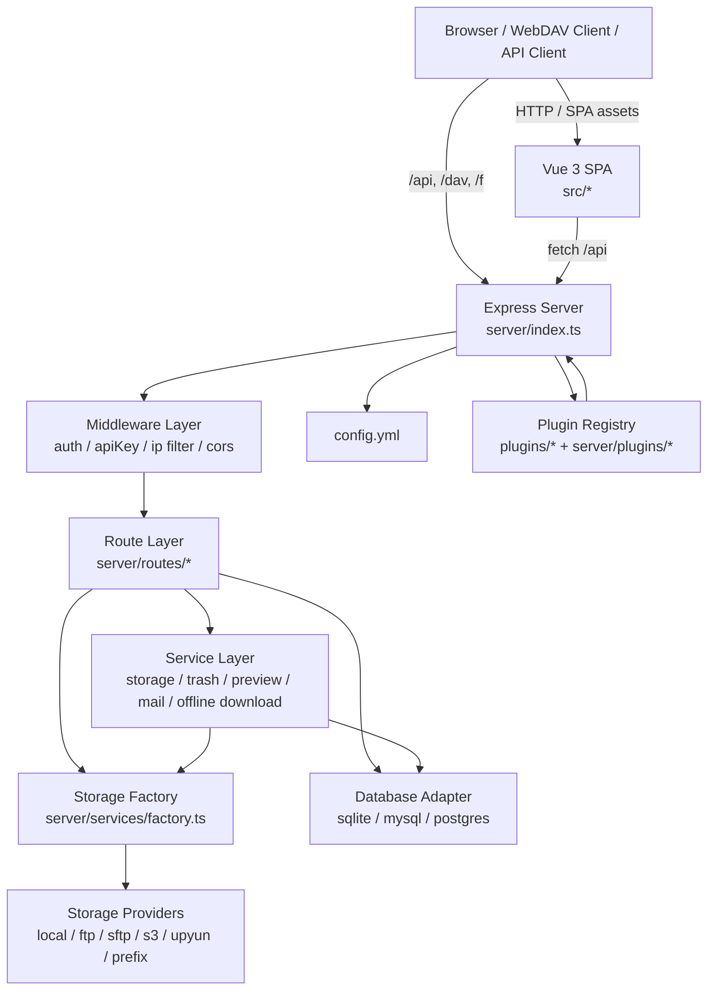
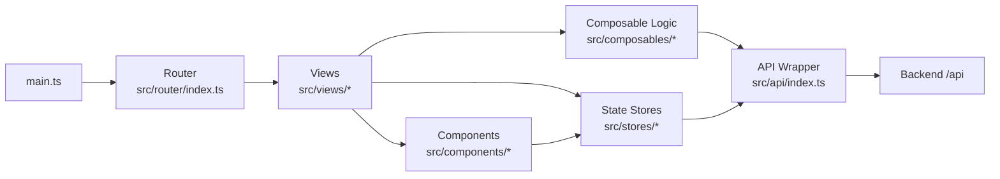
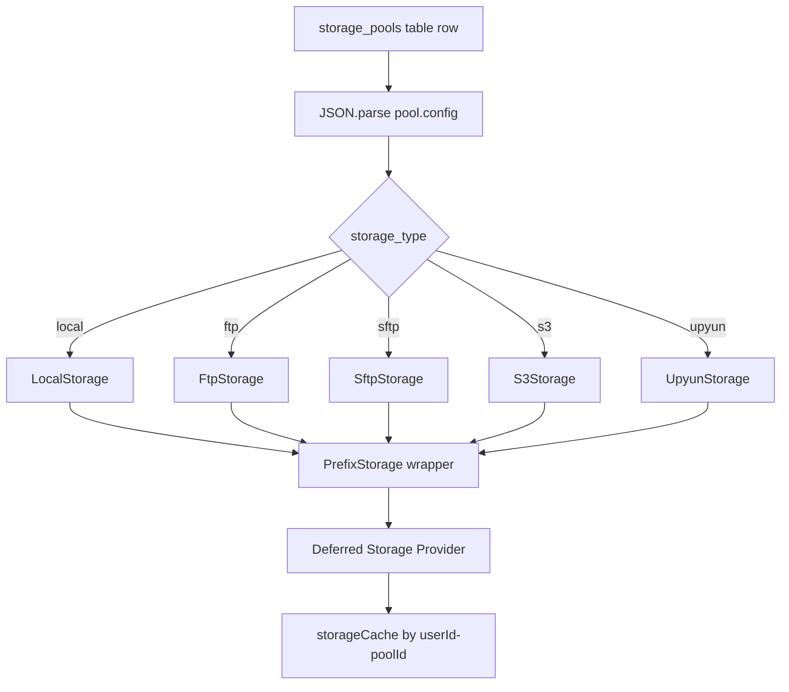
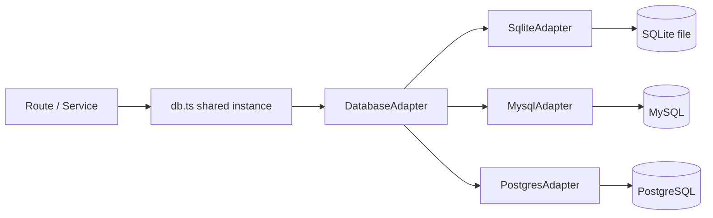
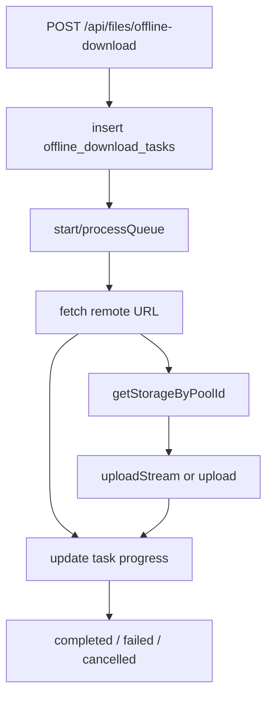

# VueFileManager System Map

## 1. Overall Architecture

`VueFileManager` is a full-stack file manager project built around:

- `src/`: Vue 3 frontend
- `server/`: Express + TypeScript backend source
- `dist/`: frontend build output
- `dist-server/`: backend build output generated from `server/*.ts`
- `plugins/`: runtime-loaded theme and feature plugins
- `config.yml`: runtime configuration center
- `data/` or external MySQL/Postgres: business data storage
- `uploads/` or remote object storage: actual file storage

`dist-server/` is a compiled artifact, not source code:

- generated by `node scripts/build-server.mjs`
- entry outputs:
  - `dist-server/index.js` from `server/index.ts`
  - `dist-server/db-cli.js` from `server/db-migrate.ts`
- production startup uses `node dist-server/index.js`

## 2. Top-Level Runtime Flow



## 3. Frontend Structure

### 3.1 Frontend Entry Chain

```text
src/main.ts
  -> src/App.vue
  -> src/router/index.ts
  -> src/stores/*
  -> src/styles/main.css
```

### 3.2 Frontend Core Layers



### 3.3 Frontend Route Modules

Main route source: `src/app/modules.ts`

Important page groups:

- authentication and no-layout pages
  - `/login`
  - `/register`
  - `/guest`
  - `/guest/:username`
  - `/s/:code`
- file operation pages
  - `/`
  - `/offline-tasks`
  - `/favourites`
  - `/my-shares`
  - `/trash`
  - `/storage-pools`
- capability and integration pages
  - `/webdav`
  - `/settings`
  - `/apikeys`
  - `/themes`
- admin pages
  - `/admin`
- documentation pages
  - `/api-docs`
  - `/theme-docs`
  - `/plugin-docs`

### 3.4 Frontend Auth and Navigation Guard

`src/router/index.ts` behavior:

- creates history router from `appRoutes`
- if localStorage has token but store has no user, it fetches current user
- `requiresAuth` routes redirect anonymous users to `GuestList`
- `requiresAdmin` routes redirect non-admin users to `Home`

### 3.5 Frontend State

Key stores:

- `src/stores/auth.ts`: current user, login state, user fetching
- `src/stores/files.ts`: current file list, path context, selection, file actions
- `src/stores/theme.ts`: theme selection and theme state

### 3.6 Frontend API Access

`src/api/index.ts` responsibilities:

- unified fetch wrapper
- auto injects `Authorization: Bearer <token>`
- uses `credentials: include`
- supports JSON request and `FormData` upload
- centralizes error parsing

## 4. Backend Bootstrap Structure

### 4.1 Backend Startup Chain

```mermaid
flowchart TD
    A[server/index.ts]
    B[createServerApp]
    C[bootstrapApp]
    D[import ./db-init]
    E[loadPlugins]
    F[startOfflineDownloadWorker]
    G[registerAppMiddleware]
    H[register protected routes]
    I[register public routes]
    J[/api public platform router]
    K[SPA fallback]
    L[startServer]

    A --> B
    B --> C
    C --> D
    C --> E
    C --> F
    B --> G
    B --> H
    B --> I
    B --> J
    B --> K
    A --> L
```

### 4.2 `createServerApp()` Main Responsibilities

Defined in `server/app/server.ts`:

- runs one-time app bootstrap
- creates Express app
- watches config file in development/runtime compatibility mode
- registers middleware
- mounts all protected and public route modules
- mounts public platform APIs under `/api`
- serves SPA fallback from `dist/`

## 5. Backend Middleware Layer

Defined mainly in:

- `server/app/middleware.ts`
- `server/middleware/auth.ts`
- `server/middleware/apikey.ts`

### 5.1 Request Handling Order

```text
Request
  -> CORS handling
  -> express.json / urlencoded parser
  -> /api IP blacklist or whitelist check
  -> block access to sensitive files
  -> static dist assets
  -> static /plugins assets when enabled
  -> route-level auth or apiKey auth
  -> business route handler
```

### 5.2 Security Responsibilities

- CORS only allows local origins by default in current code
- `/api` requests go through IP list validation
- JWT auth verifies user existence and ban state
- admin middleware enforces `role === admin`
- API key middleware supports `read / write / delete` permission model
- static access blocks `.env`, `config.yml`, `.gitignore`, and similar sensitive files

## 6. Backend Route Map

Route assembly source: `server/app/routes.ts`

### 6.1 Mounted Route Groups

```mermaid
flowchart TD
    A[Express App]
    A --> B[/api/auth]
    A --> C[/api/files]
    A --> D[/api/user]
    A --> E[/api/admin]
    A --> F[/api/guest]
    A --> G[/api/share]
    A --> H[/api/storage-pools]
    A --> I[/api/trash]
    A --> J[/api/favourites]
    A --> K[/dav]
    A --> L[/f]
    A --> M[/api public platform routes]
```

### 6.2 Route Group Responsibilities

- `server/routes/auth.ts`
  - register, login, send verification code, current user info
- `server/routes/files.ts`
  - list, info, preview, upload, stream upload, resumable upload, download
  - delete, batch delete, move, copy, cross-pool copy, write, search, zip
  - remote upload and offline download task APIs
- `server/routes/user.ts`
  - user settings, guest config, profile-related settings
- `server/routes/admin.ts`
  - aggregates:
    - `server/routes/admin/users.ts`
    - `server/routes/admin/ip-list.ts`
    - `server/routes/admin/system.ts`
- `server/routes/guest.ts`
  - guest accessible folder browsing and operations within permitted scope
- `server/routes/share.ts`
  - public/private share creation, query, download control
- `server/routes/storage-pools.ts`
  - storage pool CRUD and default pool selection
- `server/routes/trash.ts`
  - recycle bin listing, restore, permanent deletion
- `server/routes/favourites.ts`
  - favourite item CRUD
- `server/routes/public.ts`
  - `/f/*` public share access
- `server/routes/webdav.ts`
  - WebDAV protocol implementation over storage pools

## 7. File Service Call Chain

`server/routes/files.ts` is the densest business route and represents the core system path.

### 7.1 Core Flow

```mermaid
flowchart LR
    A[Frontend File Page]
    B[/api/files/*]
    C[flexibleAuth + permission check]
    D[resolve pool and path]
    E[getStorageForRequest]
    F[StorageProvider interface]
    G[Concrete storage instance]
    H[(DB metadata)]
    I[(Physical file storage)]

    A --> B
    B --> C
    C --> D
    D --> E
    D --> H
    E --> F
    F --> G
    G --> I
```

### 7.2 Important Behaviors in `files.ts`

- root listing with no `poolId` and no `path`
  - returns user storage pools as virtual folders
- real file listing
  - filters junk files like `._*`, `.DS_Store`, temp upload files
- delete by default moves files into recycle-bin flow instead of hard delete
- cross-pool copy
  - downloads from source pool
  - uploads into target pool
- preview and download
  - bridge browser/API requests to storage provider
- offline download
  - persists task in database and lets background worker process it

## 8. Storage Abstraction Layer

Storage abstraction interface: `server/services/storage.ts`

### 8.1 Unified Provider Contract

Core operations:

- `list`
- `upload`
- `uploadStream`
- `download`
- `remove`
- `mkdir`
- `info`
- `exists`
- `rename`
- `move`
- `copy`
- `search`
- `resolveLocalPath`

### 8.2 Storage Factory

Implemented in `server/services/factory.ts`



### 8.3 Supported Storage Providers

- `server/services/local.ts`
  - local filesystem storage under `storage_root`
- `server/services/ftp.ts`
  - remote FTP backend
- `server/services/sftp.ts`
  - remote SFTP backend
- `server/services/s3.ts`
  - S3-compatible object storage
- `server/services/upyun.ts`
  - Upyun object storage
- `server/services/prefix.ts`
  - logical path prefix wrapper around another provider

### 8.4 Storage Resolution Strategy

- if request specifies `poolId`, use that pool
- otherwise try user default pool
- if user has no default pool, first pool becomes default
- if user has no pool at all, system auto creates a local default pool

## 9. Database Layer

### 9.1 Database Entry

`server/db.ts`:

- loads database config from `config.yml`
- creates adapter with `createDatabaseAdapter`
- runs `initializeDatabase`
- exports shared `db` instance

### 9.2 Adapter Abstraction

`server/db-adapter.ts` provides a dialect-neutral interface:

- `prepare().get()`
- `prepare().all()`
- `prepare().run()`
- `exec()`
- `pragma()`
- `tableExists()`
- `columnExists()`
- `listColumns()`
- `close()`

### 9.3 Supported Database Dialects

- `sqlite`
  - powered by `sql.js`
  - uses compatibility wrapper in `server/db-sqljs.ts`
- `mysql`
  - powered by `mysql2/promise`
- `postgres`
  - powered by `pg`

### 9.4 Schema Initialization

`server/db-bootstrap.ts` initializes core tables such as:

- `users`
- `user_settings`
- `storage_pools`
- `api_keys`
- `shares`
- `trash`
- `favourites`
- `guest_shares`
- `ip_blacklist`
- `ip_whitelist`
- `ip_list_config`
- `verification_codes`
- `offline_download_tasks`

### 9.5 Database Layer Diagram



## 10. Plugin and Theme System

### 10.1 Load Timing

During backend bootstrap:

- `bootstrapApp()`
  - `loadPlugins()`
  - `startOfflineDownloadWorker()`

### 10.2 Plugin Registry Behavior

Implemented in `server/plugins/registry.ts`

- plugin root directory comes from `config.plugins.dir`
- scans each subdirectory under `plugins/`
- requires `manifest.json`
- supports two kinds:
  - `theme`
  - `feature`
- validates referenced files such as:
  - `style`
  - `entry`
  - `docs`
- keeps in-memory registry with enabled state

### 10.3 Plugin Public Exposure

Public APIs in `server/app/features.ts`:

- `GET /api/site-config`
- `GET /api/themes/styles`
- `GET /api/themes/list`
- `GET /api/plugins/list`
- `PUT /api/plugins/:name/toggle`
- `PUT /api/themes/:name/toggle`

Static assets:

- enabled plugin directories are served under `/plugins/*`

### 10.4 Plugin System Diagram

```mermaid
flowchart TD
    A[plugins/*]
    B[manifest.json]
    C[server/plugins/registry.ts]
    D[in-memory pluginRegistry]
    E[/api/plugins/list]
    F[/api/themes/styles]
    G[express.static /plugins]
    H[Frontend Themes / Plugin pages]

    A --> B
    B --> C
    C --> D
    D --> E
    D --> F
    A --> G
    E --> H
    F --> H
    G --> H
```

## 11. WebDAV Subsystem

Implemented mainly in `server/routes/webdav.ts`

### 11.1 Supported Capabilities

- auth through flexible auth:
  - JWT
  - API key
  - basic auth
  - query token for testing
- WebDAV methods:
  - `OPTIONS`
  - `HEAD`
  - `PROPFIND`
  - `GET`
  - `PUT`
  - `DELETE`
  - `MKCOL`
  - `MOVE`
  - `COPY`
  - partial support headers for common clients

### 11.2 Path Scoping

The route supports:

- default pool mode: `/dav/...`
- explicit pool mode: `/dav/pool/:id/...`

That means WebDAV maps protocol operations back into the same storage abstraction used by normal file APIs.

## 12. Offline Download Worker

Implemented in `server/services/offline-download.ts`

### 12.1 Worker Flow



### 12.2 Characteristics

- single-process queue model in current implementation
- task state persisted in database
- supports cancel and retry
- updates progress continuously while streaming download data

## 13. Build and Deployment View

### 13.1 Development

```text
yarn dev
  -> Vite dev server
  -> tsx watch server/index.ts
```

### 13.2 Production Build

```text
yarn build
  -> vite build
  -> node scripts/build-server.mjs
      -> dist/
      -> dist-server/
```

### 13.3 Production Startup

```text
yarn start
  -> node dist-server/index.js
```

### 13.4 Database Migration CLI

```text
yarn migrate:db:prod
  -> node dist-server/db-cli.js
```

This CLI migrates data from SQLite into MySQL or Postgres according to runtime config and CLI arguments.

## 14. Directory Responsibility Map

```text
src/
  Frontend SPA source: routes, views, components, stores, API wrapper

server/
  Backend source: app bootstrap, middleware, routes, services, DB adapters, plugin loader

scripts/
  Build tooling, especially backend bundle generation

dist/
  Frontend production bundle

dist-server/
  Backend production bundle generated by esbuild

public/
  Static assets and project docs shipped with frontend

plugins/
  Runtime plugin and theme packages

data/
  SQLite data or migration preparation data

uploads/
  Local file storage root when using local backend
```

## 15. Suggested Reading Order For New Contributors

If someone wants to understand the system quickly, this order is efficient:

1. `README.md`
2. `src/app/modules.ts`
3. `src/router/index.ts`
4. `src/api/index.ts`
5. `server/index.ts`
6. `server/app/server.ts`
7. `server/app/routes.ts`
8. `server/routes/files.ts`
9. `server/services/factory.ts`
10. `server/db.ts`
11. `server/db-adapter.ts`
12. `server/plugins/registry.ts`

## 16. Key Conclusion

This project is not a simple frontend file list UI. It is a layered file platform with:

- SPA frontend
- Express API backend
- unified storage abstraction
- pluggable storage pool system
- pluggable theme/feature system
- multi-database adapter layer
- protocol extension via WebDAV
- asynchronous background task support

From an architectural point of view, the most central backbone is:

`Frontend View -> API Wrapper -> Route Layer -> Auth/Permission Middleware -> Storage Factory / Database Adapter -> Real Storage + Real Database`
